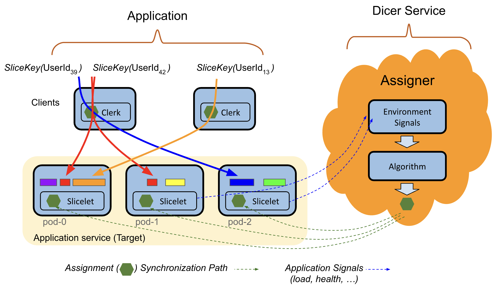
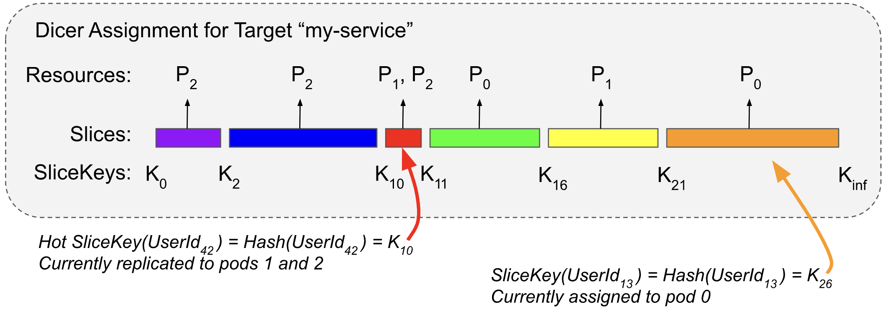

# Dicer: Databricks’ Auto-Sharder

Dicer is a foundational infrastructure system for building sharded services. By colocating in-memory state with the computation that operates on it, Dicer enables applications to achieve low latency, high availability, and cost efficiency at scale. It is widely used across Databricks, where it has driven substantial reliability and performance improvements in production systems.

To motivate Dicer, we contrast with a typical stateless model, where the application does not retain in-memory state across requests. This is inherently expensive as every request incurs a database hit (and possibly additional RPCs to other services), driving up both operational costs and latency. Introducing a remote cache, while helpful, still fails to solve several fundamental inefficiencies:
 - Network Latency: Every request still pays the "tax" of network hops to the caching layer.
 - CPU Overhead: [Significant cycles are wasted on (de)serialization](https://dl.acm.org/doi/10.1145/3317550.3321434) as data moves between the cache and the application.
 - The [Overread](https://dl.acm.org/doi/10.1145/3317550.3321434) Problem: Stateless services often fetch entire objects or large blobs from the cache only to use a small fraction of the data. These overreads waste bandwidth and memory, as the application discards the majority of the data it just spent time fetching.

However, sharding can introduce more challenges if not done correctly. We built Dicer to change this. Services can integrate with a small Dicer library, and Dicer runs as an intelligent control plane that continuously and asynchronously updates the service's shard assignments. It reacts to a wide range of signals, including application health, load, termination notices, and other environmental inputs. As a result, Dicer keeps services highly available and well balanced even during rolling restarts, crashes, autoscaling events, and periods of severe load skew.

<p align="center">
  
  <br>
  <b>Figure 1. Dicer system overview. See the section below for more details.</b>
</p>

Dicer powers critical production workloads at Databricks, and has significantly improved reliability and performance. For example:

 - **Unity Catalog**: Migrated to being a sharded service with an in-memory cache using Dicer, reducing database load by more than 10x.
 - **SQL Query Orchestration Engine**: Improved availability by 2 9s, by replacing static sharding with Dicer’s dynamic sharding. Achieved zero-down-time during rolling updates and auto-scaling, as well as improved load balancing.
 - **Softstore Distributed Remote Cache**: Our internal distributed remote caching service utilizes Dicer’s state transfer feature (to be available in a future release) to seamlessly transfer values between pods during planned restarts such as rolling updates, resulting in negligible impact to cache hit rates during rolling restarts.

In general there are many use cases for Dicer such as:

1. Caching and serving database state from local memory with low latency
2. Implementing purely in-memory systems such as remote caches or quota services
3. Rendezvous between publishers and subscribers
4. Wherever batching can help (e.g. for high throughput data ingestion)
5. Streaming data aggregation and summarization
6. Distributing regular background work among a set of workers
7. Implementing a highly available controller service using soft leader selection
8. Sharding user sessions (e.g. for KV cache reuse with LLMs)

See the [blog post](https://www.databricks.com/blog/open-sourcing-dicer-databricks-auto-sharder) for more information on background and motivation for Dicer. In this README, we discuss Dicer, its model and features, the structure of this repository, and how to get started. See the [docs](docs/) directory for further documentation.

## 1. Overview

### 1.1. Application model

Dicer models an application as serving requests or otherwise performing some work associated with a logical key. For example, a service that serves user profiles might use user IDs as its keys. Dicer shards the application by continuously generating an assignment of keys to pods to keep the service highly available and load balanced.

### 1.2. Basic concepts

We now describe the basic concepts of Dicer. Figure 2 shows an example Dicer Assignment capturing these concepts.

<p align="center">
  
  <br>
  <b>Figure 2. Dicer assigns "slices" of the SliceKey key space to resources (pods).</b>
</p>

**Target**: A string identifier of the application that Dicer will auto-shard (e.g. “myservice”), used in configs, metrics, and so on.

**Resource**: An entity to which Dicer will assign slices (today, this can only be a Kubernetes pod).

**SliceKey**: The representation of an application key to Dicer. Applications map each key in their application key space to a SliceKey, and Dicer assigns ranges of the SliceKey space to resources. SliceKeys should be a hash of the application key to evenly distribute keys across the SliceKey space (e.g. using a suitable hash function, like FarmHash).

**Slice**: To scale to applications with millions or billions of keys, Dicer operates on key ranges rather than individual keys. It partitions the SliceKey space into contiguous ranges, called slices, and assigns these slices to resources. Slices are automatically split, merged, replicated, or dereplicated as needed to maintain balanced load. Hot keys can also be isolated into their own slice and individually replicated (the red slice in Figure 1) when needed for load balancing.

**Assignment**: A complete set of non-overlapping slices which cover the full key space from “” to inf, where each slice is assigned to one or more resources.

### 1.3. Key system components

Dicer is composed of an Assigner service and two client libraries, shown in use by an application above in Figure 1.

**Assigner**: Name of the Dicer service which gathers target signals, generates assignments, and distributes those assignments to clients. The service is multi-tenant (designed to serve all Targets in a region), and supports HA.

**Slicelet**: Dicer library integrated into the servers of the Target service. Watches the Assigner service for assignment updates and caches assignments locally for fast lookup on the critical path. Notifies the application via Slicelet upcalls when the set of assigned slices to the current pod changes. Also used by the application to report load. Load information is collected locally, and reported asynchronously to Dicer off the critical path.

**Clerk**: Dicer library integrated into the clients of the Target service. Clients consult the Clerk to figure out which resource to direct a request to for a particular key. Clerks cache the assignment locally so that lookups are fast on the critical path.

### 1.4. Dicer features

* **Zero down time**: Dicer moves slices away from pods ahead of shutdown for planned restarts, ensuring zero down time during events such as rolling updates, auto-scaling, pod rescheduling, node upgrades, etc.

* **Crash detection**: Dicer detects when pods have crashed or are otherwise unresponsive and moves slices away to keep the service highly available.

* **Load balancing**: Dicer actively adjusts assignments so that each pod stays within a tolerable load band.

* **Churn sensitivity**: Dicer’s sharding algorithm tries to achieve its load balancing goals with minimal movement of keys and load, as key movement tends to be expensive for applications.

* **Fast hot key detection and isolation**: Dicer identifies hot keys in real time and adjusts the assignment accordingly to mitigate overload, including isolating extremely hot keys onto dedicated pods when necessary.

* **Asymmetric key replication**: When a key is so hot that even a dedicated pod cannot meet demand, Dicer can assign hot keys or slices to multiple pods to distribute the load. This is particularly effective for read heavy scenarios like metadata serving.

* **(Future) State transfer**: Dicer can move key *values* between pods during reassignments to enable applications to avoid cold cache misses after rolling restarts or rebalancing.

## 2. How to build and test

All the binaries and libraries can be built using [bazel](https://bazel.build/):

```
bazel build //...; bazel test //...
```

See the next section for how to actually deploy Dicer and try out the demo.

## 3. Getting Started with Dicer

To try out Dicer, the quickest way is to clone the repository and deploy it locally in a demo environment. See [dicer/demo/README.md](dicer/demo/README.md) for how to set up and run the demo, which demonstrates the use of Dicer with a sample key-value cache service and client.

For production deployments, Helm charts are available in [dicer/production/assigner](dicer/production/assigner/). Refer to [dicer/production/assigner/README.md](dicer/production/assigner/README.md) for deployment instructions.

## 4. User guide

The [user guide](docs/UserGuide.md) has detailed instructions on how to run Dicer with multiple sharded targets, various config options along with testing/debugging guidance.

## 5. Directory structure

We now describe the directory structure of the Dicer code base. In each directory, the code is in the src/ directory and the corresponding tests are in the test/ directory.

* [dicer/](dicer/): Core Dicer implementation (Assigner, client libraries, types, and demo).
  * [dicer/assigner/](dicer/assigner/): The Assigner service (the control-plane component that generates and distributes assignments).
    * [dicer/assigner/config/](dicer/assigner/config/): Static config provider.
  * [dicer/client/](dicer/client/): Client-side libraries: Clerk (routes requests using assignments) and Slicelet (server-side library).
  * [dicer/common/](dicer/common/): Shared code used by both the assigner and the clients.
  * [dicer/external/](dicer/external/): Public-facing APIs and types (Clerk, Slicelet, Slice, SliceKey, etc).
  * [dicer/demo/](dicer/demo/): End-to-end demo (deployment manifests, scripts, and demo code).
    * [dicer/demo/README.md](dicer/demo/README.md): Demo walkthrough.
    * [dicer/demo/deploy/](dicer/demo/deploy/): Demo deployment assets (configs, Docker, Helm charts).
    * [dicer/demo/scripts/](dicer/demo/scripts/): Demo setup/cleanup scripts.
    * [dicer/demo/src/](dicer/demo/src/): Demo client/server sample code.
  * [dicer/production/](dicer/production/): Production deployment artifacts (Helm charts, etc).
* [wrappers/](wrappers/): Lightweight wrappers to replace Databricks-specific infra with OSS equivalents (RPC, logging, instrumentation, config parsing, etc.).
  * [wrappers/rpc/](wrappers/rpc/): RPC abstractions used by the watch server/client helpers.
  * [wrappers/instrumentation/](wrappers/instrumentation/): Debug endpoints and instrumentation.
  * [wrappers/util/](wrappers/util/): Shared utility code (executors, shutdown hooks, etc).
* [caching/util/](caching/util/): Utilities (e.g., data structures, concurrency primitives, test utilities).
* [bazel/](bazel/): Bazel-related overlays.
* [docs/](docs/): Documentation.
* [MODULE.bazel](MODULE.bazel): Bazel module definition for this package.

## 6. Discussion

For questions, feedback, or general discussion about Dicer, please start a discussion at the Google group dicer-discuss@databricks.com. You can also browse previous discussions [here](https://groups.google.com/a/databricks.com/g/dicer-discuss).


## 7. References

**\[1\]** Atul Adya, Daniel Myers, Jon Howell, Jeremy Elson, Colin Meek, Vishesh Khemani, Stefan Fulger, Pan Gu, Lakshminath Bhuvanagiri, Jason Hunter, Roberto Peon, Larry Kai, Alexander Shraer, Arif Merchant, Kfir Lev-Ari. [*Slicer: Auto-Sharding for Datacenter Applications*.](https://www.usenix.org/system/files/conference/osdi16/osdi16-adya.pdf) Proceedings of the 12th USENIX Symposium on Operating Systems Design and Implementation (OSDI), 2016, pp. 739–753.

**\[2\]** Atul Adya, Jonathan Ellithorpe. [*Stateful services: low latency, efficiency, scalability — pick three*.](https://hpts.ws/papers/2024/2024_session8_adya.pptx) High Performance Transaction Systems Workshop (HPTS) 2024, Pacific Grove, California, September 15–18, 2024\.  

**\[3\]** Atul Adya, Robert Grandl, Daniel Myers, Henry Qin. [*Fast key-value stores: An idea whose time has come and gone*](https://dl.acm.org/doi/10.1145/3317550.3321434). Proceedings of the Workshop on Hot Topics in Operating Systems (HotOS ’19), May 13–15, 2019, Bertinoro, Italy. ACM, 7 pages. DOI: 10.1145/3317550.3321434. 

**\[4\]** Atul Adya, James Dunagan, Alexander Wolman. [*Centrifuge: Integrated Lease Management and Partitioning for Cloud Services*.](http://static.usenix.org/events/nsdi10/tech/full_papers/adya.pdf) Proceedings of the 7th USENIX Symposium on Networked Systems Design and Implementation (NSDI), 2010\.

**\[5\]** Sangmin Lee, Zhenhua Guo, Omer Sunercan, Jun Ying, Chunqiang Tang, et al. [*Shard Manager: A Generic Shard Management Framework for Geo distributed Applications*](https://research.facebook.com/file/245575980870853/Shard-Manager-A-Generic-Shard-Management-Framework-for-Geo-distributed-Applications.pdf). Proceedings of the ACM SIGOPS 28th Symposium on Operating Systems Principles (SOSP), 2021\. DOI: 10.1145/3477132.3483546. 

**\[6\]** Ziming Mao, Jonathan Ellithorpe, Atul Adya, Rishabh Iyer, Matei Zaharia, Scott Shenker, Ion Stoica (2025). [*Rethinking the cost of distributed caches for datacenter services*](https://doi.org/10.1145/3772356.3772388). Proceedings of the 24th ACM Workshop on Hot Topics in Networks, 1–8.


