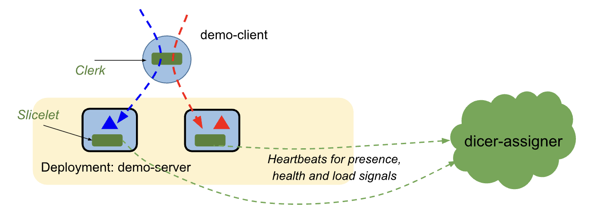

# Dicer Demo

## Overview

This demo showcases an end-to-end distributed in-memory cache service using Dicer for sharding
across multiple server instances. The demo implements a simple key-value cache service where:

**Demo Client (Clerk)**:
 - Continuously sends random requests (60% GET, 30% PUT, 10% DELETE) for 10,000 random keys
 - Watches assignments from Slicelet to discover which server owns each key
 - Load shifts every 60 seconds to simulate changing access patterns
 - Logs latency and response information

**Demo Server (Slicelet)**:
 - Exposes gRPC endpoints for Get, Put, and Delete operations
 - Uses an in-memory cache as the primary data store (5,000 entry maximum)
 - Registers with Dicer Assigner and receives key assignments via Slicelet
 - Runs 2 replicas to demonstrate Dicer's sharding and load balancing

**Dicer Assigner**:
 - Monitors Slicelet health via heartbeats
 - Generates slice assignments (which keys go to which server)
 - Streams assignment updates to Slicelets via watch API

**Note**: The setup and demo files are designed for demo purposes only, review them carefully before
using in production.

## Architecture

The figure below shows the three services that are running in their respective namespaces -
`dicer-assigner`, `demo-server` (two pods initially) and `demo-client`.



## Quick Start

### Prerequisites installation
We require the following for running the Dicer OSS demo:
1. **KIND (Kubernetes IN Docker)**
2. **Helm (Kubernetes Package Manager)**
3. **Bazelisk**: user-friendly bazel version management.
4. **Docker**

`dicer/demo/scripts/install_amd64.sh` contains the installation steps for Linux amd64.

### Setup
Run the setup script to create the cluster, build images, and deploy:

```bash
dicer/demo/scripts/setup.sh
```

This will:
- Create a KIND cluster named `dicer-demo`
- Build the Dicer Assigner, demo server and client binaries with Bazel
- Build and load the Docker images into KIND
- Deploy all services

### Verify Deployment

After running setup, verify all components are running:

```bash
# Check all pods are running
kubectl get pods -n dicer-assigner
kubectl get pods -n demo-server
kubectl get pods -n demo-client

# Expected: All pods should show STATUS=Running
# It may take 30-60 seconds for all pods to reach Running state

# View demo client logs to see it making requests
kubectl logs -n demo-client -l app=demo-client --tail=20
```

You should see the demo client making GET/PUT/DELETE requests to the demo servers.

### Upgrade Deployment

To upgrade an existing deployment with configuration changes:

1. **Modify values files**: Edit the Helm values files (e.g., change `replicaCount: 2` to `replicaCount: 4` in `dicer/demo/deploy/helm/demo-server/values.yaml`)
2. **Re-run setup script**: Run `dicer/demo/scripts/setup.sh` (or with `--ssl` if using TLS)

The setup script uses `helm upgrade --install`, so it will upgrade existing releases with the new values from the files.

### SSL/TLS Mode (Optional)

By default, the demo runs without SSL/TLS (plaintext communication). You can optionally enable
SSL/TLS with mutual authentication (mTLS) for all components using the `--ssl` flag:

```bash
dicer/demo/scripts/setup.sh --ssl
```

This will:
- Generate self-signed TLS certificates (CA, server certificates for Assigner and Demo Server,
  client certificate)
- Create Kubernetes secrets containing the certificates in each namespace
- Deploy all services with TLS enabled in the configuration

### Clean Up
Delete the KIND cluster and all resources:

```bash
dicer/demo/scripts/cleanup.sh
```

## Scenarios

You can try out various scenarios in the demo environment and observe how Dicer handles them. Every
pod (the Assigner, demo server and demo client) exposes an info service at port 7777. By performing
kubernetes port forwarding, you can browse this info server. For example, to look at the Dicer assigner:

```sh
kubectl port-forward -n dicer-assigner deployment/dicer-assigner 7777:7777
```

Then open http://localhost:7777 in your browser. Clicking on the Admin Debug link from the home page, you will be able to see the Dicer library's
state on that pod. You can expand the Assignment on the Assignment Information page to see the full
assignment and the IP addresses of the servers in the assignment.

Since this is a KIND environment, you can use your favorite tools to access it such as `kubectl`, `k9s`, `kubectx` and `kubens`. You can exec into one of the pods (e.g, the Assigner):

```sh
kubectl exec -it --context kind-dicer-demo --namespace dicer-assigner deploy/dicer-assigner -- bash
```

Logs can be fetched using `kubectl logs` or by accessing `/service.log` inside the pod.

### Scenario 0: Shifting Load

The demo client is configured to automatically shift the load pattern every 60 seconds. When the
load pattern changes in such a way that any server is significantly imbalanced in its load, Dicer
will automatically move key ranges to rebalance. The server logs added and removed ranges whenever
the assignment changes (once per minute typically).

**Watch the load shifting in action:**
```sh
# Watch the server logs to see added and removed Slices.
kubectl logs --tail=50 -f -n demo-server -l app=demo-server
```

### Scenario 1: Unclean Shutdown

You can simulate an unclean shutdown of the server by killing one of the server pod. Dicer's health
timeout is 30 seconds, after which it will remove the dead server from the assignment and reassign
the keys to the remaining servers.

```sh
# Hard kill a random server pod.
kubectl delete --force $(kubectl get pods -n demo-server -l app=demo-server -o name | shuf -n 1) -n demo-server

# Look at Assigner info service to see pod removed from assignment.
kubectl port-forward -n dicer-assigner deployment/dicer-assigner 7777:7777
# Then open http://localhost:7777 in your browser.
```

### Scenario 2: Capacity Changes

You can scale up or down the number of server pods and observe Dicer add or remove them from the
assignment as needed.

```sh
# Edit the replica count in the values file
# Change replicaCount from 2 to 4 in dicer/demo/deploy/helm/demo-server/values.yaml

# Re-run setup to apply the change
dicer/demo/scripts/setup.sh

# Watch logs to see keys being reassigned as servers are added/removed
kubectl logs -n demo-server -l app=demo-server -f
```

### Scenario 3: Rolling Restart

You can issue a kubernetes rolling restart of the server pods. If the servers implement graceful
shutdown (see the shutdown hook in DemoServerMain.scala), Dicer supports zero downtime. During a
planned restart, Dicer will detect pods that are in the process of terminating and will proactively
reassign their keys to the remaining servers. Thus, the client will not see any disruption in
service during the restarts (the Dicer Watch assignment may temporarily fail but this doesn't affect
actual service RPCs).

```sh
# Trigger a rolling restart.
kubectl rollout restart deployment/demo-server -n demo-server

# Verify zero downtime - client should see no request errors.
kubectl logs --tail=50 -f -n demo-client deployment/demo-client
```

## Troubleshooting

### Common Issues

**Pods not starting**: Check image pull and resource availability:
```bash
kubectl describe pod -n demo-server <pod-name>
```

**Connection errors**: Verify services are created and endpoints exist:
```bash
kubectl get svc -n dicer-assigner
kubectl get endpoints -n demo-server demo-server
```

**TLS errors (SSL mode)**: Verify secrets exist and certificates are valid:
```bash
kubectl get secrets -n dicer-assigner dicer-assigner-tls
kubectl describe secret -n demo-server demo-server-tls
```

### Debug Commands

```sh
# View logs.
kubectl logs -n dicer-assigner -l app=dicer-assigner -f
kubectl logs -n demo-server -l app=demo-server -f
kubectl logs -n demo-client -l app=demo-client -f

# Check pod status.
kubectl get pods -n dicer-assigner
kubectl get pods -n demo-server
kubectl get pods -n demo-client

# Verify TLS secrets (SSL mode).
kubectl get secrets -n dicer-assigner dicer-assigner-tls
kubectl get secrets -n demo-server demo-server-tls
kubectl get secrets -n demo-client demo-client-tls

# Port forward to look at the Dicer assigner's info service.
kubectl port-forward -n dicer-assigner deployment/dicer-assigner 7777:7777
# Then open http://localhost:7777 in your browser.
```

## Directory Structure

- **[`deploy/`](deploy/)**: Kubernetes Helm charts and Docker configuration. See [deploy/helm/README.md](deploy/helm/README.md) for Helm deployment details and internals.
- **[`proto/`](proto/)**: Protocol buffer definitions for the demo cache service.
- **[`scripts/`](scripts/)**: Setup, cleanup, and installation scripts.
- **[`src/`](src/)**: Source code (client/, server/, common/).
